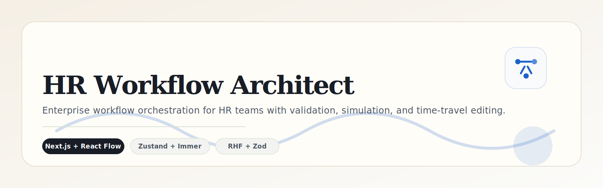

<p align="center">
  
</p>

<p align="center">
  
  
  
  
</p>

<p align="center">
  <a href="#overview">Overview</a> ·
  <a href="#architecture">Architecture</a> ·
  <a href="#feature-snapshot">Feature Snapshot</a> ·
  <a href="#module-docs">Module Docs</a> ·
  <a href="#quick-start">Quick Start</a>
</p>

---

HR Workflow Architect is an Airtable-inspired workflow builder for HR operations. It keeps the canvas, forms, validation layer, and store in sync so teams can model workflows, inspect changes, and simulate execution with confidence.

## Overview

| Area | What it does |
| --- | --- |
| App shell | Hosts layout, theme, providers, and route handlers |
| Canvas | Lets users drag, connect, and delete workflow nodes |
| Forms | Turns node data into typed, editable configuration panels |
| Sandbox | Validates graph integrity and simulates execution |
| Store | Manages graph state, selection, and undo history |

## Live Demo

🌍 **[View Live Deployment Here](https://your-deployment-url.vercel.app)**
*(Note: Replace the URL with the actual Vercel link before final commit).*

## Architecture

```text
┌──────────────────────────────┐
│ Next.js App Shell            │
│ layout + theme + routes      │
└───────────────┬──────────────┘
                │
                ▼
┌──────────────────────────────┐      ┌──────────────────────────────┐
│ Workflow Canvas              │ ---> │ Zustand Workflow Store        │
│ drag, connect, delete        │      │ nodes, edges, history, sync   │
└───────────────┬──────────────┘      └──────────────┬──────────────┘
                │                                       │
                ▼                                       ▼
┌──────────────────────────────┐      ┌──────────────────────────────┐
│ Workflow Forms               │ ---> │ Workflow Sandbox             │
│ node-specific configuration  │      │ validation + simulation      │
└──────────────────────────────┘      └──────────────────────────────┘
```

### Design Notes

- Semantic color tokens keep the interface readable in both light and dark modes.
- The shared hero SVGs live in `.github/assets` so every README feels part of the same family.
- ASCII diagrams carry the architecture story without turning the pages into wall-of-text documentation.

## Feature Snapshot

| Feature | Result |
| --- | --- |
| Drag-and-drop palette | Fast graph authoring from reusable node templates |
| Custom edge deletion | Inline removal without leaving the canvas |
| Node-specific forms | Clear, typed editing per workflow node |
| DFS validation | Prevents invalid loops before simulation |
| Undo / redo | Safe structural editing through snapshot history |
| JSON import / export | Shareable workflow state for handoff and review |
| Theme-aware UI | Consistent visual language across light and dark themes |

## Module Docs

| Folder | Guide |
| --- | --- |
| App shell | [src/app/README.md](src/app/README.md) |
| Workflow canvas | [src/features/workflow-canvas/README.md](src/features/workflow-canvas/README.md) |
| Workflow forms | [src/features/workflow-forms/README.md](src/features/workflow-forms/README.md) |
| Workflow sandbox | [src/features/workflow-sandbox/README.md](src/features/workflow-sandbox/README.md) |
| Zustand store | [src/store/README.md](src/store/README.md) |

## Quick Start

```bash
pnpm install
pnpm dev
```

Open the application at:

```text
http://localhost:3000
```

### Useful Commands

| Command | Purpose |
| --- | --- |
| `pnpm lint` | Run ESLint across the codebase |
| `pnpm build` | Produce a production build |
| `pnpm start` | Serve the built app |

## Working Principle

1. Drag nodes from the left palette into the canvas.
2. Configure node metadata in the right-hand panel.
3. Validate the graph to catch cycles and orphaned flows.
4. Run the sandbox to simulate the workflow.
5. Export, import, or continue editing with undo and redo.

This keeps the editing experience dense, legible, and safe for enterprise use.

## Future Roadmap (V2)

| Item | What it adds |
| --- | --- |
| Auto-Layout Engine | Integrates dagre to automatically format messy graphs based on edge flow. |
| Advanced Clipboard API | Adds system-wide copy/paste with UUID regeneration and edge re-mapping for deep-copying node groups. |
| Sub-flow Grouping | Uses React Flow's parentNode API to group multiple nodes into collapsible boundary boxes. |
| Smart Branch Deletion | Uses recursive BFS traversal to optionally delete all downstream nodes when a parent edge or node is removed. |
