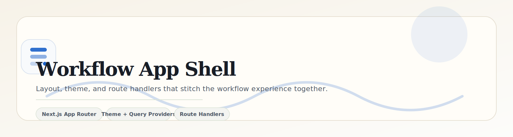

<p align="center">
  
</p>

<p align="center">
  
  
  
</p>

<p align="center">
  <a href="../../README.md">Project Root</a> ·
  <a href="../features/workflow-canvas/README.md">Canvas</a> ·
  <a href="../features/workflow-forms/README.md">Forms</a> ·
  <a href="../features/workflow-sandbox/README.md">Sandbox</a> ·
  <a href="../store/README.md">Store</a>
</p>

---

The app shell is the orchestration layer around the workflow experience. It owns the page composition, theme boundary, route handlers, and global CSS so the rest of the feature folders can stay focused on product logic.

## Module Snapshot

| Surface | Responsibility | Notes |
| --- | --- | --- |
| `layout.tsx` | Global shell and providers | Mounts theme, query, and toast providers while suppressing hydration warnings |
| `page.tsx` | Workspace composition | Renders the three-column layout with header, canvas, and config panel |
| `globals.css` | Design tokens and base theme values | Defines the light/dark semantic palette used across the app |
| `api/automations/route.ts` | Mock automation catalog | Supplies automation templates for the canvas forms |
| `api/simulate/route.ts` | Workflow simulation endpoint | Returns the mock execution timeline used by the sandbox |
| `providers/QueryProvider.tsx` | TanStack Query wiring | Keeps data fetching consistent across client surfaces |

## App Flow (Clean ASCII)

```text
┌──────────────────────────────┐
│ Next.js App Shell            │
│ layout + theme + providers   │
└───────────────┬──────────────┘
                │
                ▼
┌──────────────────────────────┐      ┌──────────────────────────────┐
│ Workspace Page               │ ---> │ Canvas + Forms + Sandbox     │
│ three-column shell           │      │ interactive feature layers   │
└───────────────┬──────────────┘      └──────────────┬──────────────┘
                │                                       │
                ▼                                       ▼
       ┌──────────────────────┐               ┌──────────────────────┐
       │ Route Handlers       │               │ Zustand Workflow Store │
       │ /api/automations     │               │ graph + history state  │
       │ /api/simulate        │               └──────────────────────┘
       └──────────────────────┘
```

## Implementation Notes

- `suppressHydrationWarning` keeps the root shell stable when `next-themes` resolves client-side theme state.
- The shell should remain thin; feature folders own canvas, forms, validation, and store behavior.
- Route handlers stay mocked and local so the workflow can be exercised without external dependencies.
- Keep the shell styling semantic so dark mode, print rendering, and future layout changes stay predictable.
