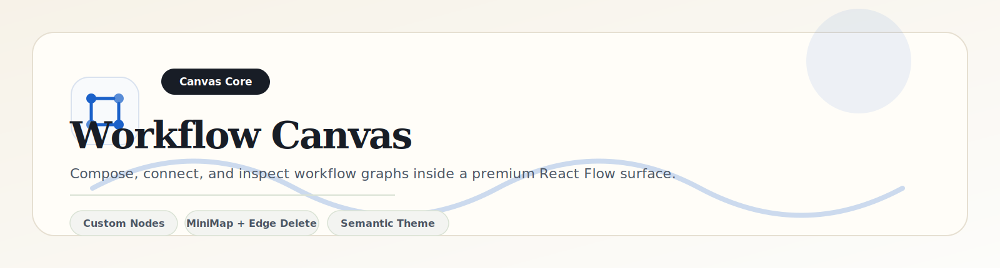

<p align="center">
    
</p>

<p align="center">
    
    
    
</p>

<p align="center">
    <a href="../../../README.md">Project Root</a> ·
    <a href="../../app/README.md">App Shell</a> ·
    <a href="../workflow-forms/README.md">Forms</a> ·
    <a href="../workflow-sandbox/README.md">Sandbox</a> ·
    <a href="../../store/README.md">Store</a>
</p>

---

# Workflow Canvas

## Overview

The workflow canvas is the visual engine of HR Workflow Architect. It combines React Flow, custom node rendering, semantic Tailwind styling, and a themed MiniMap to deliver a dense but readable enterprise canvas.

## Component Map

| Component | Responsibility | Notes |
| --- | --- | --- |
| `WorkflowCanvas` | Hosts the React Flow provider and canvas shell | Wires selection, drag/drop, edges, and theme-aware rendering |
| `CustomEdge` | Renders premium curved edges with inline delete controls | Uses `BaseEdge`, `getBezierPath`, and `EdgeLabelRenderer` |
| `NodePalette` / `DraggableSidebar` | Presents draggable workflow templates | Shares the same editorial branding language as the top header |
| `StartNode`, `TaskNode`, `ApprovalNode`, `AutomatedNode`, `EndNode` | Custom enterprise node cards | Built with Shadcn card primitives and typed node data |

## Architecture

```text
+------------------------+      +------------------------+      +--------------------------+
| Node Palette           | ---> | React Flow Canvas      | ---> | Zustand Workflow Store   |
| drag templates         |      | nodes / edges / minimap |      | history / selection      |
+------------------------+      +------------------------+      +--------------------------+
                                          |                               |
                                          v                               v
                                 +----------------+              +----------------------+
                                 | Custom Nodes   |              | Validation / Sandbox |
                                 | + Custom Edge  |              | simulate / import    |
                                 +----------------+              +----------------------+
```

## Edge and Canvas Behavior

- Custom edges are rendered with a vibrant indigo path and a compact delete affordance.
- The canvas uses theme-aware background, controls, and MiniMap styling.
- `elementsSelectable`, `deleteKeyCode`, and `selectionKeyCode` are configured to keep interaction predictable.
- The MiniMap is pannable and zoomable so users can navigate large graphs without leaving the canvas.

## Tailwind and Theme Integration

The canvas uses semantic design tokens rather than hardcoded light-mode classes. That keeps the interface consistent across light and dark themes and avoids visual fragmentation when `next-themes` toggles the app palette.

## Implementation Notes

- Keep node type registration outside render to avoid remount churn.
- Prefer semantic color tokens like `bg-background`, `bg-card`, `text-foreground`, and `border-border`.
- New node types should be added to both the canvas registry and palette template list.
