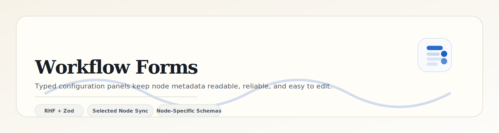

<p align="center">
  
</p>

<p align="center">
  
  
  
</p>

<p align="center">
  <a href="../../../README.md">Project Root</a> ·
  <a href="../workflow-canvas/README.md">Canvas</a> ·
  <a href="../workflow-sandbox/README.md">Sandbox</a> ·
  <a href="../../store/README.md">Store</a>
</p>

---

The workflow forms layer is where graph data becomes editable product behavior. Each node type owns a dedicated configuration form, and the ConfigPanel keeps the active node in sync with the store.

## Module Snapshot

| Surface | Responsibility | Notes |
| --- | --- | --- |
| `ConfigPanel` | Hosts the selected node form and delete action | Switches by node type and keeps the panel keyed to the selected node |
| `StartNodeForm` | Edits start node metadata | Lightweight entry state with title and message fields |
| `TaskNodeForm` | Edits task assignment details | Focused on task labels, owner context, and execution cues |
| `ApprovalNodeForm` | Edits approval thresholds and notes | Uses numeric validation for decision thresholds |
| `AutomatedNodeForm` | Edits automation actions | Matches the workflow action IDs exposed by the mock API |
| `EndNodeForm` | Edits closing metadata | Keeps the end state concise and readable |

## Form Flow (Clean ASCII)

```text
┌─────────────────────┐      ┌────────────────────────┐      ┌──────────────────────┐
│ Canvas Selection    │ ---> │ ConfigPanel            │ ---> │ RHF + Zod Validation │
│ selectedNodeId sync  │      │ type-based form switch │      │ typed partial watch  │
└─────────────────────┘      └───────────┬────────────┘      └──────────┬───────────┘
                                         │                               │
                                         ▼                               ▼
                                ┌──────────────────┐            ┌──────────────────────┐
                                │ Zustand Store    │ <--------- │ updateNodeData()     │
                                │ node data source │            │ selected node update │
                                └──────────────────┘            └──────────────────────┘
```

## Form Rules

- Each form is keyed by the selected node id so React Hook Form state resets cleanly when the selection changes.
- `watch()` output is synced back to the store using typed partial casts instead of `any`.
- Approval thresholds use `valueAsNumber` so numeric fields stay numeric end to end.
- Forms only surface the fields that matter for that node type, keeping the editor compact and easier to scan.

## Why This Layer Matters

This folder is the bridge between abstract graph nodes and human-friendly configuration. It keeps the editing experience dense without becoming confusing, and it prevents data drift by making every node type own its own contract.

## Implementation Notes

- Prefer small form components per node type instead of a single generic form.
- Keep validation local to the node schema so changes do not ripple through unrelated forms.
- When adding a new node type, add the form, the schema, and the ConfigPanel branch together.
