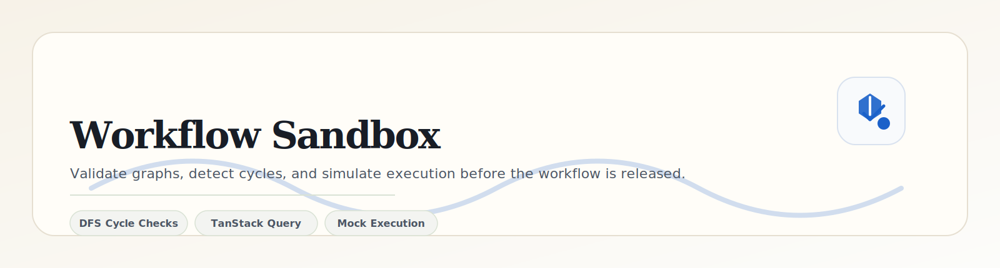

   

   
   
   

   <a href="../../../README.md">Project Root</a> ·
   <a href="../../app/README.md">App Shell</a> ·
   <a href="../workflow-canvas/README.md">Canvas</a> ·
   <a href="../workflow-forms/README.md">Forms</a> ·
   <a href="../../store/README.md">Store</a>

---

# Workflow Sandbox

## Overview

The execution sandbox is the validation and simulation boundary for the workflow graph. It is responsible for deciding whether a graph can be executed and, if valid, forwarding it to the mock simulation endpoint.

## Execution Pipeline

| Stage | Responsibility | Output |
| --- | --- | --- |
| `idle` | No simulation in progress | Ready for validation or reset |
| `validating` | Runs graph integrity checks | Validation pass or failure details |
| `executing` | Sends the graph to the simulation API | Streaming-style progress state |
| `success` | Simulation completed successfully | Execution timeline with all steps |
| `failed` | Simulation or validation failed | Actionable error state |

## DFS Cycle Detection

Cycle detection is implemented with a depth-first traversal over the node graph.

### Algorithm Summary

1. Build an adjacency map from nodes and edges.
2. Walk the graph using DFS starting from each unvisited node.
3. Track two sets:
   - `visited` for nodes already fully explored.
   - `recursionStack` for nodes currently on the active DFS chain.
4. If DFS encounters a node already present in the recursion stack, a back edge exists and the graph contains a cycle.

### Why DFS

DFS is easy to reason about, fast for the graph sizes used here, and provides immediate feedback for invalid workflow loops before the simulation layer runs.

## Simulation Behavior

The sandbox only runs after validation passes. It posts the graph snapshot to `/api/simulate`, which returns a timeline of execution steps. That timeline is then rendered in the `ExecutionTimeline` component so users can inspect the flow node by node.

## Operational Notes

- Validation errors are surfaced with clear toast feedback.
- The sandbox resets cleanly between runs so prior results do not leak into the next simulation.
- The simulation layer is intentionally mock-first, making it safe to evolve the workflow model without backend coupling.
