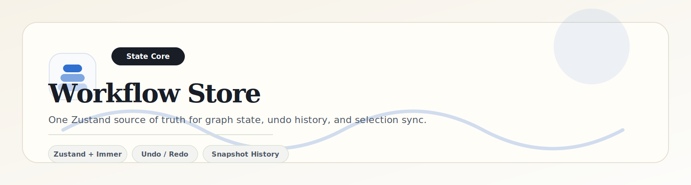

	

	
	
	

	<a href="../../README.md">Project Root</a> ·
	<a href="../app/README.md">App Shell</a> ·
	<a href="../features/workflow-canvas/README.md">Canvas</a> ·
	<a href="../features/workflow-forms/README.md">Forms</a> ·
	<a href="../features/workflow-sandbox/README.md">Sandbox</a>

---

# Zustand Workflow Store

## Overview

The workflow store is the single source of truth for canvas state. It keeps nodes, edges, selection, and time-travel history synchronized across the canvas, forms, header actions, and sandbox.

## State Model

| Slice | Type | Purpose |
| --- | --- | --- |
| `nodes` | `Node<NodeData>[]` | Current canvas nodes |
| `edges` | `Edge[]` | Current canvas connections |
| `selectedNodeId` | `string \| null` | Controls the active config panel |
| `past` | `GraphSnapshot[]` | Undo history stack |
| `future` | `GraphSnapshot[]` | Redo history stack |

## Immer Mutation Strategy

The store uses Zustand with Immer middleware so structural updates remain expressive while still producing immutable snapshots.

| Action | Behavior |
| --- | --- |
| `addNode` | Pushes a new node onto the canvas |
| `updateNodeData` | Mutates the selected node payload in place via Immer |
| `deleteNode` | Removes a node and its connected edges |
| `deleteEdge` | Removes a single custom edge |
| `clearCanvas` | Empties the graph while preserving undo history |
| `importGraph` | Hydrates nodes and edges from JSON |

## Undo / Redo History

A lightweight temporal stack stores graph snapshots before structural mutations. When a structural action occurs, the current graph is cloned into `past` and `future` is cleared. Undo pops from `past` and moves the current state into `future`. Redo performs the inverse.

## Synchronization Rules

- Node selection is mirrored into `selectedNodeId` so the right panel can stay in sync.
- Node and edge deletion clears stale selection when necessary.
- Graph import replaces the current canvas state and resets selection to avoid stale references.
- Edge creation defaults to the custom edge type so deletion and styling remain consistent.

## Design Notes

This store intentionally avoids React Context. Zustand keeps the state graph simple, testable, and performant under React Flow's frequent update patterns.

## V2 State Management

The planned clipboard architecture for copy and paste needs an interceptor layer rather than a shallow JSON clone. On paste, every node and edge must receive brand-new UUIDs, and each edge source and target must be remapped to the newly generated node IDs before insertion. That prevents key collisions, preserves graph integrity, and lets node groups be duplicated safely without inheriting stale references.
